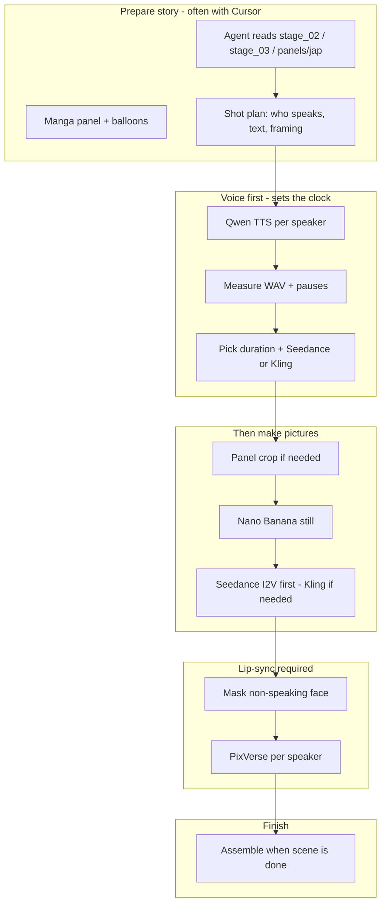

# AI Animation — Student workbook (English)

**Print these (easier to read on paper):**

| Booklet | PDF | Read when |
|---------|-----|-----------|
| **0 — Cursor guide** | [cursor-student-workbook-en-cursor-guide.pdf](cursor-student-workbook-en-cursor-guide.pdf) | **First:** @ files, /skills, Agent mode, credits |
| **1 — Setup** | [cursor-student-workbook-en-setup.pdf](cursor-student-workbook-en-setup.pdf) | **Day 1:** what project does, install, folders, manga RTL |
| **2 — First try (S006)** | [cursor-student-workbook-en-s006-first-try.pdf](cursor-student-workbook-en-s006-first-try.pdf) | **Day 2:** 12 steps — @ files not copy-paste paths |
| **3 — Skills reference** | [cursor-student-workbook-en.pdf](cursor-student-workbook-en.pdf) | **Full skills workflow** + troubleshooting |

Regenerate all PDFs: `python scripts/build_student_workbook_pdf.py`

**Other language:** [粵語版 Cantonese](cursor-student-workbook-yue.md)

**Audience:** Beginners — no coding background needed.  
**Goal:** Use **Cursor Agent** to turn one manga panel into anime: picture → voice → moving video → lip-sync.

**Example story:** *Frieren* chapter 81, camp page `002.jpg`, shot **S006** (first lesson).

### Which part of this file does what?

| Section | Plain name | What you learn |
|---------|------------|----------------|
| **§0** | Rules | Copyright, API key safety, costs |
| **§1–2** | **Setup booklet** | What to install; download ZIP; open Cursor |
| **§3** | **Folder guide** | What each folder is for (simple words) |
| **§4** | **Pipeline** | Order of work: voice before video, etc. |
| **§5** | **Read manga right** | Full page image; right-to-left order |
| **§5.5** | **Skills guide** | What `/skills` do and when to use each one |
| **§6** | **S006 first-try booklet** | 12 steps: one complete shot |
| **§7–12** | Prompt templates | Copy-paste after you know §6 |
| **§13–16** | Help & cheat sheet | Problems, reading list, one-liner prompt |

**Start here:** Print **Cursor guide PDF** → **Setup PDF** → **S006 PDF**. Use **@ in Cursor chat** to pick files (do not copy paths). Type **`/skill-name` first** on every production step. **Voice:** generate **Fern and Frieren** WAV on S006. **Video:** **Seedance first**, Kling only if needed. Each step labels **FREE vs USES FAL CREDITS**.

---

## 0. Before you start (legal and expectations)

| Topic | Rule |
|-------|------|
| **Copyright** | Manga pages, character designs, and anime stills belong to **rights holders**. This repo is **tooling + workflow docs** for **education / research**. Do **not** publish full chapters or commercial cuts without permission. |
| **API keys** | You need your own **[Fal.ai](https://fal.ai)** account. **Never** commit `.env`, keys, or voice reference WAVs. |
| **How long is a clip?** | **Dialogue decides.** Generate **Qwen WAV first**, measure its length (+ pauses between speakers), then pick **Seedance** seconds or **Kling `5`s/`10`s** and any **in-betweens** so the video covers the speech. |
| **Your main tool** | **Cursor Agent** + **`/skills`** — you write prompts; the Agent reads canon files and runs scripts. Attach skills so the Agent does not lose project context. |
| **Cost** | Every Fal call uses credits. Start with **one shot**, then scale. |

---

## 1. What you need (before opening the project)

| Item | Who sets it up | Why |
|------|----------------|-----|
| **[Cursor](https://cursor.com)** | **You** — install like any desktop app | Your main workspace; Agent runs the pipeline for you |
| **Python 3.10+** on the PC | **Mentor** (one-time) | Agent runs `scripts/` — you do not type Python commands |
| **This project folder** | **You** — §2 below (ZIP download) | Story files, skills, scripts |
| **Manga JPGs** (`Chapter-81/002.jpg` …) | **Mentor** — copy into your folder | Not stored on public GitHub |
| **Fal.ai API key** | **You** — free account | Pays for image/video/voice API calls |
| **ffmpeg** | **Mentor** (optional) | Final video assembly; skip at first |

**You do not need Git or the terminal** for setup. Use the **manual steps in §2** and **Cursor Agent** for everything else.

---

## 2. Get the project on your computer (manual — no terminal)

Follow these steps **in order**. Use **File Explorer** and **your web browser** — not PowerShell or Command Prompt.

### 2.1 Download the project from GitHub

1. Open your browser and go to the project GitHub page (your mentor will give you the URL).
2. Click the green **Code** button.
3. Choose **Download ZIP** (not “Clone” — that needs Git).
4. Wait for the download to finish (file name like `AI_Animation-main.zip`).
5. Open your **Downloads** folder in File Explorer.
6. **Right-click** the ZIP → **Extract All…** → choose a simple path, e.g. `C:\Work\AI_Animation`.
7. After extract, you should see a folder named `AI_Animation` (or `AI_Animation-main` — **rename** it to `AI_Animation` if needed).

**Check:** Inside the folder you should see `Chapter-81`, `docs`, `scripts`, `.cursor`, and `README.md`.

### 2.2 Copy files your mentor provides

Git does **not** include manga scans or generated images. Ask your mentor for a USB copy or shared drive link:

| Copy into your project | What it is |
|------------------------|------------|
| `Chapter-81/001.jpg` … `018.jpg` | Manga page scans (you need **`002.jpg`** for §6) |
| `panels/eng/` and `panels/jap/` (optional) | Pre-cropped panels — saves time if mentor already made them |
| `Voice Reference/` (optional) | Qwen voice refs — mentor may already have these |

**Check:** You can open `Chapter-81/002.jpg` in Windows Photos and see the full camp page.

### 2.3 Open the project in Cursor

1. Launch **Cursor** from the Start menu.
2. Menu **File → Open Folder…**
3. Browse to `C:\Work\AI_Animation` (or where you extracted).
4. Click **Select Folder**.
5. In the **left sidebar**, expand folders — confirm you see `docs/cursor-student-workbook-en.md`.

**Check:** The window title shows your folder name; you are not in an empty “Welcome” screen only.

### 2.4 Add your Fal API key (edit a text file — no terminal)

1. In Cursor’s left file tree, find **`.env.example`** in the project root.
2. **Right-click** → **Copy**.
3. **Right-click** empty space in the file tree → **Paste**.
4. **Rename** the copy from `.env.example copy` to **`.env`** (exactly — starts with a dot).
5. Click **`.env`** to open it.
6. Replace `your_key_here` with your real key from [fal.ai/dashboard/keys](https://fal.ai/dashboard/keys).
7. **File → Save** (or Ctrl+S).

```env
FAL_KEY=paste_your_key_here
```

**Never** share this file or commit it to GitHub.

### 2.5 One-time Python setup (ask Agent — you do not run commands)

Your mentor should have **Python installed** on the PC. You run setup **once** through Cursor:

1. Open **Agent** chat (mode selector at top of chat).
2. Paste:

```text
First-time project setup for a beginner. Do NOT ask me to use the terminal myself.

1. Create Python venv .venv if missing
2. pip install -r requirements.txt
3. Confirm .env exists (I already added FAL_KEY)
4. Report success or any error in plain language

Do not change any shot files or run Fal API yet.
```

3. If Agent asks permission to run commands, click **Allow** — that is normal; **you** are not typing them.
4. When Agent says setup is complete, you are ready for §6.

**If setup fails:** Send a screenshot to your mentor — do not guess terminal fixes yourself.

---

## 3. What is in the project folder? (simple guide)

Think of the project as **two piles of files**:

| Comes in the ZIP download | You or mentor add later |
|---------------------------|-------------------------|
| Story notes (`Chapter-81/`) | Manga page photos (`002.jpg` …) |
| Helper programs (`scripts/`) | Cropped panels (`panels/`) |
| How-to docs (`docs/`) | Your pictures and videos (`Tests/`, `outputs/`) |
| Agent recipes (`.cursor/skills/`) | Your secret API key (`.env`) |

**You do not need to open `scripts/` yourself.** Cursor Agent runs them when you use prompts + skills.

### Each folder — what it is for

| Folder / file | Simple name | What it holds | When you use it |
|---------------|-------------|---------------|-----------------|
| **`Chapter-81/`** | Story bible | Text files: page order, shot list, style notes | Agent reads these every shot — attach `@stage_02` `@stage_03` |
| **`Chapter-81/002.jpg`** | Manga page photo | Full scanned page (not in ZIP — mentor copies) | §5 RTL reading; cropping panels |
| **`panels/eng/`** | Panel crops (English scan) | One small PNG per shot (`panel_s006.png`) | Before making anime still |
| **`panels/jap/`** | Panel crops (Japanese) | Same panel with JP speech balloons | **Dialogue truth** — voice and lip-sync |
| **`Tests/`** | Work-in-progress pictures | Anime stills Agent just made | Check quality before approving |
| **`Tests/Final/`** | Approved pictures | Good stills you keep for video | Starting point for video step |
| **`outputs/voice/`** | Dialogue audio | `.wav` files of characters speaking | After voice step; before lip-sync |
| **`outputs/video/`** | Video clips | `.mp4` moving shots | After video step; before lip-sync |
| **`docs/`** | Handbooks | This workbook and technical guides | Reading / printing |
| **`.cursor/skills/`** | Agent checklists | Rules that keep Agent on track | Type `/skill-name` in chat |
| **`.env`** | Your API key | `FAL_KEY=...` (you create from `.env.example`) | Pays for Fal image/video/voice |

### Shot IDs (`S002`, `S006`, …)

One **shot** = one manga panel turned into one anime clip. The number is the ID in `stage_02_shot_list.md`. Always tell Agent **one shot only** (e.g. “S006 only”) so it does not change other work.

---

## 4. The pipeline — dialogue drives timing

Full recipe: [`manga-to-anime-fal-stages.plan.md`](../manga-to-anime-fal-stages.plan.md).

**Old mistake:** Pick 5s/10s from the panel “feel,” then squeeze dialogue in.  
**Correct order:** Analyze panel → **generate voice** → **measure WAV** → **then** choose duration, in-betweens, and video model (**Seedance first**, Kling fallback).



| Stage | You do (often via Cursor Agent) | Output |
|-------|----------------------------------|--------|
| **1–3 Story** | Ingest, shot list, bible for **S###** | `stage_01`–`stage_03` |
| **Analyze** | Read JP balloons, speakers, line order | Timing notes in chat or shot doc |
| **5b Voice** | **Qwen TTS first** — one WAV per speaker line | `outputs/voice/final/S###/*.wav` |
| **Timing** | Sum speech + pauses; map to Seedance sec or Kling 5/10s | `--duration`, `--start-sec`, in-between A/B |
| **4 Still** | Panel or multi-ref → Nano Banana | `Tests/Final/S###_*.png` |
| **5 Motion** | **Seedance first** → Kling if needed; duration fits dialogue | `outputs/video/S###_*.mp4` |
| **5c Lip-sync** | Mask → PixVerse → combine if 2 speakers | `outputs/video/LipsyncTests/*.mp4` |
| **6 Assemble** | Concat shots for a **scene** (any length) | Scene `.mp4` |
| **7 Fix** | One issue per pass | `stage_04_s###_visual_qc_log.md` |

**Golden rules:** (1) **Voice before video length.** (2) Fix **panel crops** and **stage_02** before prompt tweaks. (3) Ask **Cursor** to read files — do not guess dialogue from EN scans alone.

---

## 5. Manga reading order (students often get this wrong)

Japanese manga is **not** left-to-right like Western comics.

- Within a page: **right → left**, then **top → bottom**.
- Shot IDs in `stage_02_shot_list.md` follow that order — **not** the order panels appear if you scan left-to-right on screen.
- **Full page scans** live in `Chapter-81/002.jpg` (and `001.jpg`–`018.jpg`). These are **not in Git** on most clones; copy from your mentor’s `Chapter-81/` folder if missing.

### 5.1 Full page example — `002.jpg` (camp scene)

Open the **whole page** before you crop. You must see **where each shot sits** and read in **manga order**.


**Story read path on this page** (numbers = order you watch the anime scene):

| Read # | Shot | Where on page | What happens |
|--------|------|---------------|--------------|
| **1** | **S002** | Top — full width | Wide camp establish: party, fire, packs |
| **2** | **S003** | Middle row — **right** panel | Fern + squirrel messenger |
| **3** | **S004** | Middle row — **left** panel | Fern hands letter; Frieren + grimoire — **has dialogue** |
| **4** | **S005** | Bottom row — **right** panel | Fern CU — Lernen telegraph memory |
| **5** | **S006** | Bottom row — **middle** panel | Camp debate — **§6 walkthrough shot** (Frieren at tree, Fern by fire) |

```
Western mistake (LTR):  S002 → S004 → S003 → S006 → S005   ← WRONG story order
Manga order (RTL):      S002 → S003 → S004 → S005 → S006   ← CORRECT
```

**Rule:** When in doubt, open `panels/jap/panel_s###jap.png` and `stage_02` — **balloon order** is ground truth for dialogue shots.

If you crop panels in geometric LTR order, **story order breaks**. Always check `stage_02` before saving `panels/eng/panel_s###.png`.

---

## 5.5 Skills — what they are and when to use them

### What is a “skill”?

A **skill** is a **recipe file** in `.cursor/skills/`. When you type **`/skill-name`** in Cursor chat, the Agent must read that recipe first — like giving a new worker a checklist so they do not guess.

**Without skills:** Agent may read panels in the wrong order, skip voice, pick the wrong video tool, or lip-sync the wrong mouth.

**With skills:** Agent reads the right story files, runs the right program, and reports file paths back to you.

### Skills workflow — order for a dialogue shot (e.g. S006)

```text
0. /manga-chapter-ingest-stages-1-3  → study page RTL, map panels to S### (FREE)
1. /manga-panel-crop-for-shots     → cut panel PNG from manga page
2. /qwen-frieren-dialogue          → make voice WAV (BEFORE video length)
3. /nano-banana-2-prompting        → grey panel → colored anime still
4. /anime-scene-i2v-prompting      → still → moving video (Seedance first)
5. /pixverse-lipsync               → video + WAV → mouth moves on correct face
```

**Every chat message:** `/skill` first + click **@** to pick files **by name** + **one shot** (`S006 only`). Do not copy paths from examples.

---

### Skill details (plain English)

#### `/manga-chapter-ingest-stages-1-3` — **study the manga page first**

| | |
|--|--|
| **Use when** | Before crop or voice — you need **RTL read order**, which panel is **S006**, who speaks |
| **Agent does** | Reads `stage_01` (page read path), `stage_02` (shot row), `stage_03` (dialogue notes); explains in plain English |
| **Pick in @ menu** | `002.jpg`, `stage_01_ingest.md`, `stage_02_shot_list.md`, `stage_03_series_bible.md` |
| **You get** | You know **which panel** is your shot and **dialogue order** before spending Fal credits |
| **Student rule** | **READ only** — do not rewrite stage files unless your mentor asks |
| **Stops mistakes** | Reading page left-to-right, wrong panel, guessing dialogue |

#### `/manga-panel-crop-for-shots`

| | |
|--|--|
| **Use when** | You need `panels/eng/panel_s###.png` from a manga page |
| **Agent does** | Opens `stage_02`, finds the right panel on `002.jpg`, saves one crop |
| **Pick in @ menu** | `stage_02_shot_list.md`, `002.jpg` |
| **You get** | `panels/eng/panel_s006.png` (and JP crop if needed) |
| **Stops mistakes** | Cropping wrong panel, uploading full page, mirrored layout |

#### `/qwen-frieren-dialogue` (and character skills like `/fern-dialogue-s005`)

| | |
|--|--|
| **Use when** | Panel has **speech balloons** — always **before** video |
| **Agent does** | Reads JP text from `panels/jap`, runs Qwen TTS, saves `.wav` files |
| **Pick in @ menu** | `panel_s006jap.png`, `stage_03_series_bible.md` |
| **You get** | `outputs/voice/final/S006/*.wav` + **seconds** per line |
| **Stops mistakes** | Wrong dialogue text, video too short, bad `--start-sec` timing |

#### `/nano-banana-2-prompting`

| | |
|--|--|
| **Use when** | You have a panel crop and need a **colored anime picture** |
| **Agent does** | Runs Nano Banana 2 image edit; uses color/style rules from project |
| **Pick in @ menu** | `panel_s006.png`, `stage_02_shot_list.md`, `stage_03_series_bible.md` |
| **You get** | PNG in `Tests/` → you approve → `Tests/Final/` |
| **Stops mistakes** | Everyone turns blue, manga halftone left in, wrong costume colors |

#### `/anime-scene-i2v-prompting`

| | |
|--|--|
| **Use when** | Approved still in `Tests/Final/` — time to make **video** |
| **Agent does** | Tries **Seedance** first; uses **Kling** if two faces or policy error |
| **Pick in @ menu** | `S006_....png` still from Tests/Final, `stage_03_series_bible.md` |
| **You get** | `outputs/video/S006_....mp4` |
| **Stops mistakes** | Pasting still prompt into video, wrong model, clip shorter than dialogue |

#### `/pixverse-lipsync`

| | |
|--|--|
| **Use when** | You have video + voice WAV and need **mouth to move** |
| **Agent does** | Masks the **non-speaking** face; runs PixVerse; combines if two speakers |
| **Pick in @ menu** | `S006_....mp4` from outputs/video/, speaker WAV from outputs/voice/final/S006/ |
| **You get** | Lip-synced MP4 in `outputs/video/LipsyncTests/` or similar |
| **Stops mistakes** | Wrong character’s mouth moves, both speakers in one pass |

#### Other skills (less common at first)

| Skill | When |
|-------|------|
| **`fal-image-to-video-prompting`** | Extra Fal API details when video step fails |
| **`qwen-stark-dialogue`** | Stark speaking (shots S011, S012) |
| **`fern-dialogue-s005`** | Fern-only line on S005 |

---

**Student rule:** `/skill` + **@ pick by name** + `S### only`. Agent runs programs — you write prompts (§12 cookbook).

---

## 6. End-to-end walkthrough — one panel (Shot **S006**)

**What is S006?** A **shot ID** from the story notes (`stage_02_shot_list.md`) — one manga panel turned into one anime clip. **S006** = camp debate (Frieren at tree, Fern by fire). **S006A** = extra close-up of Fern (not in the manga) for her lip-sync line.

**Goal:** Learn the **full production workflow once**: manga panel → **voice (both speakers)** → still → video (**Seedance first**) → **S006A insert** → lip-sync. After §6, every other panel is the **same steps** with a different `S###` ID.

**Why S006:** Two speakers, MS two faces, voice-first timing, **S006A insert** for Fern — the complete pattern, not a shortcut.

**Before you start:** Read **Cursor guide PDF**; finish §2 setup; `.env` has `FAL_KEY`; `002.jpg` from mentor; Cursor **Agent** mode.

**How to attach files:** Click **@** in chat and pick files **by name** from the sidebar. Do **not** copy long paths from this doc — your folder names may differ.

### 6.0 Workflow map (memorize this order)

| Step | What | Skill | Credits |
|------|------|-------|---------|
| 1 | **Study page** — find S006 (RTL) | `/manga-chapter-ingest-stages-1-3` | **FREE** |
| 2 | Understand dialogue | `/manga-chapter-ingest-stages-1-3` | **FREE** |
| 3 | Crop panel | `/manga-panel-crop-for-shots` | **FREE** |
| 4 | **Voice BOTH speakers** | `/qwen-frieren-dialogue` | **USES FAL** (Fern + Frieren = 2 calls) |
| 5 | Pick duration + model | Agent reports WAV seconds | **FREE** (plan only) |
| 6 | Still **S006** | `/nano-banana-2-prompting` | **USES FAL** |
| 7 | In-between **S006A** | `/nano-banana-2-prompting` | **USES FAL** |
| 8 | Video **S006** | `/anime-scene-i2v-prompting` | **USES FAL** — **Seedance first** |
| 9 | Video **S006A** | `/anime-scene-i2v-prompting` | **USES FAL** — **Seedance first** |
| 10 | Lip-sync Fern on **S006A** | `/pixverse-lipsync` | **USES FAL** |
| 11 | Lip-sync Frieren on **S006** | `/pixverse-lipsync` | **USES FAL** |
| 12 | Handoff | — | **FREE** |

**Golden rule:** **Voice WAV before video length.** **Try Seedance first** on video; use **Kling** only if Seedance fails or MS two-face needs it. Fern’s line → **S006A**; Frieren’s lines → **S006** MS.

---

### Step 1 — Study page 002 — locate S006 (FREE)

**Skill:** `/manga-chapter-ingest-stages-1-3`

1. Open `Chapter-81/002.jpg` (§5.1).
2. **@ pick:** `002.jpg`, `stage_01_ingest.md`, `stage_02_shot_list.md`
3. Prompt:

```text
/manga-chapter-ingest-stages-1-3
Study page 002.jpg only. Read RTL panel order from stage_01 + stage_02.
Where is shot S006? Explain in simple words for a beginner.
READ only — do not edit stage files. No Fal API calls.
```

**Success check:** Agent explains S006 is **bottom row, middle panel** — **5th in read order** on this page.

---

### Step 2 — Understand S006 dialogue (FREE)

**Skill:** `/manga-chapter-ingest-stages-1-3`

1. **New chat** → **Agent** mode (or continue same chat).
2. **@ pick:**

| Pick in @ menu | What it is |
|----------------|------------|
| `002.jpg` | Full manga page |
| `panel_s006jap.png` | S006 panel with Japanese speech balloons |
| `stage_01_ingest.md` | RTL read path notes |
| `stage_02_shot_list.md` | Shot list — what S006 is |
| `stage_03_series_bible.md` | Dialogue + style notes |

3. Prompt:

```text
/manga-chapter-ingest-stages-1-3
Explain shot S006 only for a beginner.
Use stage_02, stage_03, and the JP panel I picked.
Who speaks first? Why do we need S006A?
READ only. No Fal API calls.
```

**Success check:** Agent lists **Fern** then **Frieren** (two balloons), mentions **S006A** for Fern CU lip-sync.

---

### Step 3 — Crop the manga panel (FREE)

**Skill:** `/manga-panel-crop-for-shots`

**@ pick:** `stage_02_shot_list.md`, `002.jpg`

```text
/manga-panel-crop-for-shots

Crop panel_s006.png for shot S006 only.
- Bottom row MIDDLE panel on 002.jpg
- Also confirm panel_s006jap.png exists or crop JP balloons
- ONE panel only; report paths
```

**You QC:**

- [ ] `panels/eng/panel_s006.png` — Frieren at tree + Fern by fire
- [ ] `panels/jap/panel_s006jap.png` — readable JP balloons (dialogue truth)

---

### Step 4 — Voice FIRST — **both Fern and Frieren** (USES FAL CREDITS)

**Skill:** `/qwen-frieren-dialogue`  
**Credits:** **2 Fal calls** on S006 — one WAV per speaker.

**@ pick:** `panel_s006jap.png`, `stage_03_series_bible.md`

```text
/qwen-frieren-dialogue for S006

Generate ALL S006 dialogue WAVs — Fern AND Frieren (both speakers per stage_03).
- Voice BEFORE still or video
- Report each WAV path and duration in seconds
- Report recommended --start-sec: Fern ~0.35s, Frieren ~0.55s
S006 only. I approve Fal spend for voice.
```

**You QC:**

- [ ] **Two** WAV files under `outputs/voice/final/S006/` — **Fern** and **Frieren**
- [ ] Agent reports seconds (Fern ~2s; Frieren long line ~9–10s)
- [ ] You understand: **total speech** drives video duration on S006

---

### Step 5 — Timing + model (FREE — plan only)

**@ pick:** folder or files under `outputs/voice/final/S006/`

```text
From S006 WAV lengths: pick video duration and model.
- ALWAYS try Seedance FIRST (project default)
- If Seedance fails OR MS two-face needs it: Kling 5s or 10s
- Fern line: S006A insert + S006 main clip plan
S006 only. No new API calls.
```

**Success check:** Agent plans **Seedance first** on S006/S006A; notes **Kling 10s fallback** if MS two-face; **S006A** for Fern lip-sync.

---

### Step 6 — Anime still S006 (USES FAL CREDITS)

**Skill:** `/nano-banana-2-prompting`  
**@ pick:** `panel_s006.png`, `stage_02_shot_list.md`, `stage_03_series_bible.md`

```text
/nano-banana-2-prompting for S006

Generate Stage 4 still for S006 only.
- Locked MS composition: Frieren at tree, Fern by fire
- Nano Banana 2 edit; save to Tests/ then Tests/Final/ if QC passes
S006 only. I approve Fal spend for still.
```

**You QC still:** no halftone, camp colors match S002, both characters readable.

---

### Step 7 — In-between still S006A (USES FAL CREDITS)

Fern’s mouth is small in the MS panel — production uses **S006A** MCU insert.

**@ pick:** `S006` still from Tests/Final, `S005` still from Tests/Final, `stage_03_series_bible.md`

```text
/nano-banana-2-prompting for S006A insert

MCU Fern face by fire for lip-sync bridge. Multi-ref from S006 camp + S005 Fern identity.
S006A only. Save to Tests/Final/. I approve Fal spend for still.
```

**Success check:** `Tests/Final/S006A_....png` — Fern face forward, mouth clear.

---

### Step 8 — Video S006 (USES FAL CREDITS — Seedance first)

**Skill:** `/anime-scene-i2v-prompting`

**@ pick:** your `S006_....png` still from Tests/Final, `stage_03_series_bible.md`

```text
/anime-scene-i2v-prompting for S006

Try Seedance FIRST for S006 MS two-face.
- Match duration to Frieren dialogue WAV (~9-10s)
- If Seedance fails or faces drift: retry Kling 2.6 Pro 10s
- Locked camera; subtle motion only; --anime-limited --anime-fps 12
S006 only. I approve Fal spend for video.
```

---

### Step 9 — Video S006A (USES FAL CREDITS — Seedance first)

**@ pick:** your `S006A_....png` still from Tests/Final

```text
/anime-scene-i2v-prompting for S006A

Try Seedance FIRST on Fern CU insert (~5s). Kling fallback if needed.
Locked camera. For Fern line lip-sync. S006A only. I approve Fal spend for video.
```

---

### Step 10 — Lip-sync Fern on S006A (USES FAL CREDITS)

**Skill:** `/pixverse-lipsync`  
**@ pick:** `S006A` video MP4 from outputs/video/, Fern WAV from outputs/voice/final/S006/

```text
/pixverse-lipsync for S006A Fern

Single-speaker PixVerse. Fern CU only.
--start-sec 0.35. S006A only. I approve Fal spend for lip-sync.
```

---

### Step 11 — Lip-sync Frieren on S006 (USES FAL CREDITS)

Two faces in frame → **mask Fern**, animate Frieren only.

**@ pick:** `S006` video MP4, Frieren WAV, `stage_03_series_bible.md`

```text
/pixverse-lipsync for S006 Frieren

Mask/block Fern face. PixVerse Frieren lines only.
--start-sec ~0.55. S006 only. I approve Fal spend for lip-sync.
```

**You QC:** Fern’s line audible on **S006A** clip; Frieren’s mouth moves on **S006** clip — not the wrong face.

---

### Step 12 — Shot handoff (you finished the lesson)

```text
Return the Section 9.7 handoff block for S006 + S006A.
Include all WAV durations, video model, lip-sync paths, and assembly order S006A then S006 for this beat.
```

Example shape:

```markdown
## Shot S006 handoff
- **Speakers / JP lines:** Fern あまり乗り気じゃ… / Frieren 大陸魔法協会も… + 正式な依頼…
- **WAV paths + durations:** (paths + seconds)
- **Video model:** Seedance first; Kling 10s fallback if MS two-face (S006)
- **In-between:** S006A Fern MCU + Kling 5s
- **Lip-sync:** S006A Fern pass; S006 Frieren pass (Fern masked)
- **Output paths:** panel, S006 still, S006A still, videos, lipsync MP4s
```

**Done:** You learned the **full workflow**. Next panels (S004, S005, S003…) reuse Steps 1–12 with the same skills — only dialogue and framing change.

---

### Step 13 — Simpler shots after S006

| Shot | What is easier |
|------|----------------|
| **S003** | No voice/lip-sync — still + Seedance video only |
| **S005** | One speaker — voice + single PixVerse pass |
| **S004** | Like S006 but shorter — dual mask lip-sync practice |

Open §7–§11 for prompt templates. Always **`/skill`** first + **@ pick** `panel_s###jap.png` on dialogue shots.

---

## 7. Prompt: generate an anime still (Stage 4)

**How to use these templates:** Click **@** in chat, pick files **by name**, then send the prompt. Do not copy folder paths like `@Chapter-81/...`.

### 7.1 Panel crop (if missing)

**@ pick:** `stage_02_shot_list.md`, `002.jpg`

```text
/manga-panel-crop-for-shots
Crop panel_s003.png for shot S003 from page 002.jpg. One panel only.
```

### 7.2 Generate still

**@ pick:** `panel_s003.png`, `stage_02_shot_list.md`, `stage_03_series_bible.md`

```text
/nano-banana-2-prompting for S003

Generate the Stage 4 anime still for S003 only.
- Default: Nano Banana 2 edit
- Run the project script; do not change other shots
- If QC passes, save approved PNG under Tests/Final/
- Report output path when done
```

### 7.3 Fix a drifting still

**@ pick:** your S003 still from Tests/, `panel_s003.png`

```text
/nano-banana-2-prompting for S003 — Fern hair drifts green; fix fal_common or lead-in only. S003 only.
```

### 7.4 In-between still (method A — no manga panel)

**@ pick:** S005 still + S006 still from Tests/Final, `stage_03_series_bible.md`

```text
/nano-banana-2-prompting for S006A insert

MCU Fern face for lip-sync bridge between S005 and S006. Multi-ref edit. S006A only.
```

---

## 8. Prompt: generate video (Stage 5) — Seedance first, then Kling

Handbook: [`docs/stage5-image-to-video-fal.md`](stage5-image-to-video-fal.md). Skill: **`anime-scene-i2v-prompting`**.

### 8.1 Model routing (repo default)

| Try first | Fall back to Kling when |
|-----------|------------------------|
| **Seedance 2.0** `bytedance/seedance-2.0/image-to-video` | `generated_video` policy error; **MS two-face** dialogue (e.g. S004, S006); CU lip-sync-heavy performance |
| **Kling 2.6 Pro** `fal-ai/kling-video/v2.6/pro/image-to-video` | Seedance failed twice; need `--anime-limited` TV timing; in-between B extend |

| Framing | Default |
|---------|---------|
| **WS**, backs to camera, small figures (S002, S010) | **Seedance** + optional `--audio` for ambience |
| **MCU** single face (S003, S005, S006A) | **Seedance** first; **Kling** if face motion policy fails |
| **MS two faces** (S004, S006) | **Kling** (Seedance often blocked after render — see S004 logs) |

**Duration:** Pick **after voice WAV** (§10). Seedance: `"4"`–`"15"` or `"auto"`. Kling: **`"5"`** or **`"10"`** only.

### 8.2 Prompt — Seedance (try this first)

**@ pick:** S002 still from Tests/Final, `stage_02_shot_list.md`, `stage_03_series_bible.md`

```text
/anime-scene-i2v-prompting for S002

Generate video for S002 only.
1. Read stage_02 framing — this is a wide establish
2. Try Seedance 2.0 I2V FIRST with generate_s002_seedance_i2v.py
3. Duration from dialogue/beat (no speech on S002 — your call, suggest 5-10s)
4. Use --audio for camp ambience if appropriate
5. Write motion prompt per skill §4b (production wording, locked camera)
6. Report output MP4 path. If Seedance policy fails, say so and propose Kling fallback.
```

### 8.3 Prompt — Kling (fallback or MS two-face)

**@ pick:** S004 still from Tests/Final, `panel_s004jap.png`

```text
/anime-scene-i2v-prompting for S004

MS two-face shot — route to Kling 2.6 (not Seedance).
- Duration must fit dialogue WAV totals from §10 (likely 10s)
- --anime-limited and --anime-fps 12
- S004 only. Report MP4 path.
```

### 8.4 Prompt — in-between B (extend last frame)

**@ pick:** S006B still from Tests/Final

```text
/anime-scene-i2v-prompting for S006B continuation

Method B: end-frame hold from S006. Kling 5s continuation, locked camera, --audio.
Duration driven by whether we still need visual bridge time after dialogue QC.
```

---

## 9. How to work with Cursor Agent (main skill)

**You are not expected to run this pipeline from memory.** Cursor Agent reads the repo, runs scripts, and reports back. Your job: **clear goals**, **@ pick the right files by name**, **approve credits**, **QC the result**.

### 9.1 Modes

| Mode | Use when |
|------|----------|
| **Agent** | Generate stills, run Fal scripts, fix prompts, build voice, lip-sync — **default for production** |
| **Ask** | “What does S004 dialogue order mean?” — read-only questions |
| **Plan** | Big new chapter ingest before spending credits |

Turn on **Agent** when you want the AI to run Fal scripts for you.

### 9.2 Full session prompt (one shot — edit `S###`)

**@ pick at each step** (by file name — do not copy paths):

| Step | Pick in @ menu |
|------|----------------|
| 1 Analyze | `panel_s004jap.png`, `stage_02_shot_list.md`, `stage_03_series_bible.md` |
| 2 Voice | same JP panel + stage_03 |
| 4 Still | `panel_s004.png`, stage files |
| 5 Video | S004 still from Tests/Final |
| 6 Lip-sync | S004 video MP4 + voice WAVs |

```text
Shot S004 only. /skill each step.

STEP 1 — Analyze (no Fal yet)
List speakers, JP lines, balloon order. Estimate speech timing.

STEP 2 — Voice FIRST (/qwen-frieren-dialogue or character skill)
Generate all Qwen WAVs for S004. Report each file path and duration in seconds.

STEP 3 — Pick video duration + model
From WAV lengths: choose clip length. Try Seedance first unless MS two-face → Kling.

STEP 4 — Still if missing (/nano-banana-2-prompting)
Generate S004 still → Tests/Final/

STEP 5 — Video (/anime-scene-i2v-prompting)
Seedance first; Kling if routing says so. Match duration to dialogue.

STEP 6 — Lip-sync (/pixverse-lipsync)
Mask non-speaking face per speaker. Two passes for dual dialogue. Combine + mux.

Return shot handoff block (§9.7) when done.
```

Order is always: **analyze → voice → duration → still → video (Seedance→Kling) → masked lip-sync**.

### 9.3 Skills quick map (see §5.5 for why)

Always type **`/skill-name`** at the start of the step that needs it.

### 9.4 Reference files with `@`

Click **@** and pick **ground truth** the Agent cannot invent:

| Goal | Pick in @ menu |
|------|----------------|
| Dialogue order | `panel_s006jap.png`, `stage_03_series_bible.md` |
| WAV timing check | the specific `.wav` file Agent created (search by speaker name) |

Example prompt after picking files:

```text
For S006: list each speaker line in order, estimate speech time, recommend Seedance or Kling duration.
```

```text
This Frieren WAV is ~9.9s — extend with in-between B or use --duration 10 and check tail clip.
```

### 9.5 Good prompts (teach the Agent what you want)

- “**Type `/anime-scene-i2v-prompting`** — try **Seedance first**.”
- “**Analyze panel first** — dialogue duration before video.”
- “**S006 only** — do not change other shots.”
- “**Voice first** — report WAV seconds, then pick duration + model.”
- “**Crop first** — `/manga-panel-crop-for-shots`.”
- “**Dry-run** before Fal credits.”
- “**`/pixverse-lipsync`** — mask both faces for S004 dual dialogue.”

### 9.6 Bad prompts

- “Make the whole chapter anime.” (No shot scope.)
- “5 second video” without mentioning dialogue length.
- “Fix the video” without `S###`, WAV path, or MP4 path.
- Pasting API keys in chat.

### 9.7 What the Agent should return each shot

Ask for this handoff block in chat (or from skills):

```markdown
## Shot S### handoff
- **Speakers / JP lines:** (from panels/jap + stage_03)
- **WAV paths + durations:** (seconds each)
- **Pause between speakers:** (e.g. 0.6s)
- **Total speech window:** (sum)
- **Video model:** Seedance (tried?) or Kling (why)
- **Clip duration:** seconds (+ in-between A/B if needed)
- **--start-sec per speaker:** (for PixVerse)
- **Mask lip-sync plan:** one pass or two
- **Output paths:** still, video, voice, lipsync MP4s
```

---

## 10. Dialogue-driven timing (how long each clip should be)

**You choose duration after Qwen WAV length** — not from the panel alone.  
**Seedance:** `"4"`–`"15"` or `"auto"`. **Kling:** `"5"` or `"10"` only.

### 10.1 Timing workflow (per shot)

| Step | Who | Action |
|------|-----|--------|
| **0** | You + Agent | `/manga-chapter-ingest-stages-1-3` — study page RTL + S### row |
| **1** | You + Agent | @ pick `panel_s###jap.png` + `stage_03` — list speakers, JP text, balloon order |
| **2** | Agent | `/qwen-frieren-dialogue` (or character skill) → WAV per speaker |
| **3** | Agent | Report each WAV length (ffprobe or script meta JSON) |
| **4** | You + Agent | Add **pauses** between speakers (e.g. 0.35–0.6s) and **mux start offsets** (`--start-sec`) |
| **5** | You + Agent | **Total needed** = last line end time. Map to Seedance seconds or Kling 5/10 |
| **6** | Agent | If speech > clip cap: **in-between B**, **compact dialogue**, or split shot |
| **7** | Agent | Still → **Seedance first** (or Kling if MS two-face) → mask lip-sync |

**Example (S006):** Fern ~2.1s @ 0.35s; Frieren v3 ~9.9s @ 0.55s → ends ~10.45s → **Kling 10s** (MS two-face); Fern lip-sync on **S006A** insert.

**Example (S002):** No dialogue → **Seedance** ~5–8s wide establish; `--audio` for camp ambience.

### 10.2 Silent or no-dialogue panels

If a panel has **no speech** (establishing wide, reaction without balloon):

- Ask Agent: “Does `stage_03` list dialogue for S002?”
- Duration = **story beat only** (often 5s hold, 10s if scene transition) — still **shorter is fine**.
- No Qwen/PixVerse for that shot — skip to next speaking panel.

### 10.3 Example scene — page `002.jpg` camp (B2)

Build **one scene at a time** with Agent; total runtime = **sum of shots**, not a fixed 60s target.

| Order | Shot | Dialogue? | Duration driver | Video model |
|-------|------|-----------|-----------------|-------------|
| 1 | **S002** | No | Beat hold | **Seedance** |
| 2 | **S003** | No / ambient | Critter beat | **Seedance** first |
| 3 | **S004** | Fern + Frieren | **2 WAVs + pause** | **Kling** (MS two-face) |
| 4 | **S005** | Fern read | **Fern WAV** | Seedance or Kling |
| 5 | **S006A** | Fern line | **~2s WAV** | Kling on insert |
| 6 | **S006** | Fern + Frieren long | **~9.9s WAV** | **Kling 10s** |
| 7 | **S006B** | Bridge | Visual hold | Kling +5s extend |

Ask Cursor (**@ pick:** `stage_03_series_bible.md`, any `panel_s###jap.png` files for S002–S006):

```text
/anime-scene-i2v-prompting

Analyze page 002 shots S002-S006. Voice-first: generate missing WAVs, report seconds.
Per shot: recommend Seedance vs Kling and clip duration. S002-S006 plan only — no Fal yet.
```

### 10.5 In-between shots (two methods)

Use an in-between when the manga shot is **hard to lip-sync** (back to camera, wrong angle) or you need **more time** before the next panel.

| Method | What it is | When to use | How |
|--------|------------|-------------|-----|
| **A — New frame (Nano Banana)** | New still, better lip-sync angle (e.g. S006A) | Face not visible in panel MS | `/nano-banana-2-prompting` → then video prompt |
| **B — Extend last video frame** | Screenshot last frame → +5s/10s continuation (S006B) | Need hold time after long dialogue clip | `/anime-scene-i2v-prompting for S006B` |

**S006A prompt:** see §7.4. **S006B prompt:** see §8.4.

### 10.4 Production checklist (per shot)

```markdown
- [ ] stage_02 row read — correct Layer (present vs flashback)
- [ ] panels/eng/panel_s###.png cropped
- [ ] Stage 4 still in Tests/Final
- [ ] Stage 5 video: **Seedance tried first** (or Kling if routed); duration fits WAV
- [ ] In-between if needed: **A** new Nano still **or** **B** extend last frame (+5s/10s)
- [ ] Stage 5b: Qwen WAV per speaker (`outputs/voice/final/S###/`)
- [ ] Stage 5c: face mask(s) + PixVerse lip-sync per speaker
- [ ] File named with shot ID for assembly
```

### 10.6 Assemble scene (Stage 6)

```text
Assemble page 002 camp scene in story order S002→S006B.
Use lipsync/final clips where they exist. Concat with ffmpeg.
Report total duration. Scene length = sum of dialogue-backed shots.
```

**Done criterion:** Every spoken line audible, lip-sync on correct face, no line cut off because clip was too short.

---

## 11. Voice and lip-sync (required — Stage 5b + 5c)

Every shot with **dialogue in `stage_03`** must ship with **Qwen voice** and **PixVerse lip-sync**. **Generate voice before you lock video duration or model.**

Full formula: [`docs/qwen-voice-pipeline-formula.md`](qwen-voice-pipeline-formula.md) · PixVerse log: [`docs/pixverse-lipsync-log.md`](pixverse-lipsync-log.md).

### 11.1 Prompt — voice / audio (Qwen TTS — **first**)

**@ pick:** `panel_s006jap.png`, `stage_03_series_bible.md`

```text
/qwen-frieren-dialogue for S006

Generate ALL dialogue WAVs for S006 (Fern + Frieren lines per stage_03).
- Voice BEFORE any video generation
- Report each WAV path and exact duration in seconds
- Report recommended --start-sec for lip-sync mux
- S006 only. Use project scripts; I approve Fal spend for voice.
```

Fern-only shot example (**@ pick:** `panel_s005jap.png`):

```text
/fern-dialogue-s005 for S005
Generate Fern Qwen WAV for S005. Report duration seconds.
```

### 11.2 Prompt — lip-sync (PixVerse — mask faces first)

**PixVerse = one mouth per pass.** Block the **non-speaking** face in a video editor or via project mask scripts.

**Dual speaker (S004)** — **@ pick:** S004 video MP4, voice WAVs in outputs/voice/final/S004/, `s004-dual-dialogue-lipsync.md` if present:

```text
/pixverse-lipsync for S004 dual dialogue

Mask lip-sync BOTH speakers:
1. Fern line — block Frieren face — PixVerse pass — start ~1.0s
2. Frieren line — block Fern face — PixVerse pass — start ~3.1s
3. Combine passes + mux both WAVs with 0.6s pause
S004 only. Report final MP4 paths.
```

**Single speaker (S006A Fern)** — **@ pick:** S006A video MP4, Fern WAV:

```text
/pixverse-lipsync for S006A Fern

Single-speaker PixVerse. Fern CU — no mask needed if only Fern face visible.
--start-sec 0.35. S006A only.
```

**Do not** ask for one PixVerse pass with **both speakers’ audio** on a two-face frame.

### 11.3 Framing + in-between rules

| Framing | Lip-sync approach |
|---------|-------------------|
| **CU / MCU** face toward camera | Direct PixVerse (one speaker) or mask if second face visible |
| **MS two faces** | **Mask pipeline** — one pass per speaker |
| **Back to camera** | **In-between A** (new Nano frame) or cut to CU insert before voice |
| **Need more time same angle** | **In-between B** — extend last frame +5s/10s (S006B) |

---

## 12. Prompt cookbook — quick index

| You want | Skill + @ pick + prompt starter |
|----------|----------------------------------|
| **Study manga page** | `/manga-chapter-ingest-stages-1-3` + pick `002.jpg` + stage_01 + stage_02 |
| **Panel crop** | `/manga-panel-crop-for-shots` + pick `stage_02`, `002.jpg` |
| **Anime still** | `/nano-banana-2-prompting` + pick `panel_s###.png` + stage files |
| **Voice / audio** | `/qwen-frieren-dialogue` + pick `panel_s###jap.png` + “voice FIRST, report seconds” |
| **Video** | `/anime-scene-i2v-prompting` + pick still from Tests/Final + “**Seedance first**” |
| **Lip-sync** | `/pixverse-lipsync` + pick video MP4 + speaker WAV + “mask other face” |
| **Full shot** | §9.2 session prompt (all steps + skills) |
| **First panel** | §6 walkthrough (S006 full workflow) |
| **Scene plan** | `/anime-scene-i2v-prompting` + “analyze S002–S006, voice-first, no Fal yet” |

**Behind the scenes:** The Agent runs scripts in `scripts/` (e.g. `generate_s###_seedance_i2v.py`, `generate_s###_kling_i2v.py`). You do not need to type Python — use prompts above.

---

## 13. Common problems

| Symptom | Likely cause | Fix |
|---------|--------------|-----|
| Wrong character placement / mirrored scene | Bad panel crop or full-page ref | Re-crop `panels/eng/panel_s###.png` |
| Colors bleed (everyone turns blue) | Greyscale manga + vague prompt | Read `docs/manga-greyscale-to-color.md`; lock garment colors in `fal_common.py` |
| Agent guesses wrong dialogue | No skill / no JP panel | `/skill` + @ pick `panel_s###jap` + `stage_03` |
| Video morphs faces | Motion too aggressive | `/anime-scene-i2v-prompting` — locked camera; Kling `--anime-limited` |
| Seedance `generated_video` fail | MS two-face (S004 class) | **Expected** — prompt Agent to switch to **Kling** (do not retry Seedance blindly) |
| Lip-sync wrong mouth | PixVerse got two faces; no mask | `/pixverse-lipsync` — mask non-speaking face; one pass per speaker |
| Dialogue cut off | Clip too short vs WAV | Voice first — longer Seedance duration or Kling 10s; in-between B |
| No mouth visible | Back to camera / bad MS | In-between **A** (Nano CU) or **B** (extend frame) |
| `Missing FAL_KEY` | No `.env` | Copy `.env.example` → `.env` |
| `Tests/` empty after ZIP download | Gitignored | Run §6 with Agent |

---

## 14. Week-by-week syllabus (suggested)

| Week | Deliverable |
|------|-------------|
| **1** | §2 manual setup + **complete §6 on S006** (full workflow lesson) |
| **2** | **S004** or **S005** — repeat §6 pattern on a second dialogue shot |
| **3** | **S002–S003** — silent shots (still + Seedance; no voice) |
| **4** | Assemble page `002` camp scene — length = dialogue total, not a fixed target |

---

## 15. Further reading (in repo)

| Doc | Topic |
|-----|-------|
| [`README.md`](../README.md) | Repo overview |
| [`manga-to-anime-fal-stages.plan.md`](../manga-to-anime-fal-stages.plan.md) | Full stage recipe |
| [`docs/flux-2-pro-prompting-guide.md`](flux-2-pro-prompting-guide.md) | Prompt structure (applies to Nano Banana) |
| [`docs/manga-greyscale-to-color.md`](manga-greyscale-to-color.md) | B&W manga → color |
| [`docs/stage5-image-to-video-fal.md`](stage5-image-to-video-fal.md) | Kling + Seedance API |
| [`docs/sfx-models-fal.md`](sfx-models-fal.md) | Post-I2V sound |
| [`Voice Reference/README.md`](../Voice Reference/README.md) | Voice folder layout |

---

## 16. Cursor one-liner cheat sheet

Use in a new chat after you **@ pick** files by name:

```text
AI_Animation — Shot S### only.
EVERY step: /skill-name first, then @ pick files by name.
Start: /manga-chapter-ingest-stages-1-3 to study page RTL + S###
Pick often: stage_01_ingest.md, stage_02_shot_list.md, panel_s###jap.png

Order: analyze → voice (report WAV sec) → duration → still → video (Seedance FIRST, Kling fallback) → /pixverse-lipsync with face masks.
In-between: A=/nano-banana-2-prompting insert OR B=extend last frame.
Do not commit .env. Ask for §9.7 handoff when done.
```

---

*Last updated: 2026-06-05 (manual §2 setup; S006 full-workflow §6).*
