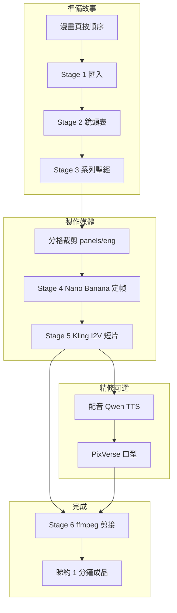

# AI Animation — 學生實習手冊（粵語 · Cursor + Fal.ai）

**English version:** [English workbook](cursor-student-workbook-en.md)

**對象：** 由零開始學呢個 repo 嘅實習生同學生。  
**目標：** 由 GitHub 下載專案、設定 Cursor，跟團隊同一條 pipeline，由漫畫分格做出 **大約一分鐘** 可以睇得明嘅動畫片段。

**實作例子：** *Frieren* 第 81 話（「El Dorado」）— 第 `002.jpg` 頁營地場景（鏡頭 **S002–S006**）。

---

## 0. 開始之前（法律同期望）

| 項目 | 規則 |
|------|------|
| **版權** | 漫畫頁、角色設計、動畫畫面屬於 **版權方**。呢個 repo 只係 **工具同流程文件**，用嚟 **教學／研究**。冇授權 **唔好** 公開成章或商用剪接。 |
| **API 金鑰** | 你需要自己嘅 **[Fal.ai](https://fal.ai)** 帳戶。**千祈唔好** commit `.env`、金鑰、或 voice reference WAV。 |
| **「一分鐘動畫」喺呢度係咩** | 一條有時間軸嘅序列：AI 生成 **定帧圖 + 短片**（每段 5–10 秒），可選 **對白 + 口型同步** — 唔係電視台成品集。 |
| **費用** | 每次 Fal API 都會扣 credits。先由 **一個鏡頭** 做起，再放大規模。 |

---

## 1. 安裝工具

| 工具 | 用途 |
|------|------|
| **[Cursor](https://cursor.com)** | 有 AI Agent 嘅 IDE — 會讀 repo 入面嘅 skills 同 markdown 正本。 |
| **Git** | 下載 repository。 |
| **Python 3.10+** | 行生成腳本。 |
| **ffmpeg** | 建議裝 — 12 fps 動畫後處理、混音、最後剪接。[下載](https://ffmpeg.org/download.html) 並加入 `PATH`。 |

檢查：

```powershell
python --version
git --version
ffmpeg -version
```

---

## 2. 由 GitHub 下載 → 建立專案資料夾

### 2.1 Clone

```powershell
cd C:\Work\YourProjects
git clone https://github.com/<ORG>/AI_Animation.git
cd AI_Animation
```

（將 `<ORG>` 換成你哋機構嘅 repo 網址。）

### 2.2 Python 環境

```powershell
python -m venv .venv
.\.venv\Scripts\Activate.ps1
pip install -r requirements.txt
```

`requirements.txt` 好細：`fal-client`、`python-dotenv`、`Pillow`。

### 2.3 API 金鑰

```powershell
copy .env.example .env
```

喺專案根目錄改 **`.env`**：

```env
FAL_KEY=your_key_here
```

拎金鑰：[fal.ai/dashboard/keys](https://fal.ai/dashboard/keys)。

### 2.4 用 Cursor 開啟

1. **File → Open Folder** → 揀 `AI_Animation`。
2. 想 AI 幫你行腳本、改檔案時，用 **Agent** 模式。
3. 聊天時可以 attach skills（見 §8）。

---

## 3. Repo 入面有咩（同冇咩）

Git 只存 **工作流程**，唔會存你生成嘅媒體檔。

| Git 有 | Git 冇（要喺本機自己建立） |
|--------|---------------------------|
| `Chapter-81/stage_01_ingest.md` … `stage_03_series_bible.md` | 漫畫原圖 JPG（`001.jpg` …） |
| `scripts/` — Fal 腳本 | `panels/eng/panel_s###.png` 分格裁剪 |
| `docs/` — 指南 | `Tests/`、`Tests/Final/` — PNG 定帧 |
| `.cursor/skills/` — Agent 食譜 | `outputs/` — JSON log、影片、配音 |
| `.env.example` | 有你金鑰嘅 `.env` |

**意思：** Clone 完之後你有 **故事結構同腳本**，但要自己加 **漫畫掃描圖** 同 **分格裁剪**（或者由導師部機 copy）先可以做 Stage 4。

### 資料夾地圖

```
AI_Animation/
├── Chapter-81/              # Stage 1–3（可選 stage_04 QC log）
│   ├── stage_01_ingest.md   # 頁序、劇情節拍、漫畫閱讀規則
│   ├── stage_02_shot_list.md# 鏡頭 ID S001… — 景別、對白參考
│   └── stage_03_series_bible.md  # 風格 + 每鏡 Fal 備註
├── panels/
│   ├── eng/panel_s002.png   # 每鏡一格裁剪（你自己做）
│   └── jap/panel_s004jap.png# 日文對話氣球（對白正本）
├── scripts/
│   ├── fal_common.py        # S###_PROMPT_FLUX 內文
│   ├── generate_s###_ref_edit.py   # Stage 4 定帧
│   ├── generate_s###_kling_i2v.py # Stage 5 影片
│   ├── qwen_tts.py          # 配音（進階）
│   └── lipsync_fal.py       # PixVerse 口型（進階）
├── Tests/                   # 生成中嘅定帧
├── Tests/Final/             # 確認版 PNG → 俾 I2V 用
├── outputs/
│   ├── fal/                 # API log
│   ├── video/               # MP4 片段
│   └── voice/               # 對白 WAV
├── docs/                    # 手冊（呢份、Stage 5、配音等）
└── .cursor/skills/          # Cursor Agent skills
```

---

## 4. 流程用白話講（7 個 Stage）

完整食譜：[`manga-to-anime-fal-stages.plan.md`](../manga-to-anime-fal-stages.plan.md)。



| Stage | 你做咩 | 產出 |
|-------|--------|------|
| **1 匯入** | 列出 `001.jpg`→`018.jpg`，標劇情節拍 | `stage_01_ingest.md` |
| **2 鏡頭表** | 每格一列 → **S###** ID、景別、邊個喺畫面 | `stage_02_shot_list.md` |
| **3 系列聖經** | 全劇動畫風格 + 每鏡 prompt 備註 | `stage_03_series_bible.md` |
| **4 關鍵帧** | 漫畫裁剪 → **Nano Banana 2 edit** → 動畫 PNG | `Tests/S###_nano-banana-2-edit_*.png` |
| **5 動態** | 確認版 PNG → **Kling 2.6** 5 或 10 秒 | `outputs/video/S###_*.mp4` |
| **6 剪接** | 接片段、trim、加對白 | 一條約 60 秒 `.mp4` |
| **7 修正循環** | 每次只記一個問題做 QC | `stage_04_s###_visual_qc_log.md` |

**黃金法則：** 先搞掂 **故事檔（1–3）** 同 **分格裁剪**，先至改 prompt。裁剪錯 = 構圖永遠錯。

---

## 5. 漫畫閱讀順序（好多學生會搞錯）

日本漫畫 **唔係** 西式漫畫咁由左至右。

- 一頁入面：**右 → 左**，再 **上 → 下**。
- `stage_02_shot_list.md` 嘅鏡頭 ID 跟呢個順序。
- 例子第 `002.jpg` 頁（營地）：廣角 **S002** → 松鼠 **S003** → 信 **S004** → Fern 特寫 **S005** → 辯論 **S006**。

如果你用幾何上 **由左至右** 裁剪，**故事順序會亂**。一定要對 `stage_02` 同 `panels/jap/panel_s###jap.png` 嘅氣球順序。

---

## 6. 逐步做：你第一張定帧（Stage 4）

### 6.1 揀一個鏡頭

建議由 **S003**（一張臉 + 松鼠）或 **S009**（風景，容錯高）開始。營地對白鏡 **S004–S006** 較難 — 第二週先做。

讀 [`Chapter-81/stage_02_shot_list.md`](../Chapter-81/stage_02_shot_list.md) 嗰列，同 [`Chapter-81/stage_03_series_bible.md`](../Chapter-81/stage_03_series_bible.md) 對應章節。

### 6.2 分格裁剪

1. 開該鏡頭嘅頁面 JPG（例如 S003 用 `002.jpg`）。
2. 只裁 **一格** — 唔好連 gutter、鄰格。
3. 存做 `panels/eng/panel_s003.png`。

Skill：[`.cursor/skills/manga-panel-crop-for-shots/SKILL.md`](../.cursor/skills/manga-panel-crop-for-shots/SKILL.md)。

喺 Cursor 聊天：

```text
Crop panel_s003.png from page 002.jpg per stage_02 shot S003
Use skill: manga-panel-crop-for-shots
```

### 6.3 生成動畫定帧

預設模型：**`fal-ai/nano-banana-2/edit`**（Nano Banana 2）。

```powershell
cd scripts
python generate_s003_ref_edit.py
```

- Prompt = `S003_EDIT_LEAD_IN` + `S003_PROMPT_FLUX`（喺 script 同 `fal_common.py`）。
- 輸出：`Tests/S003_nano-banana-2-edit_<timestamp>.png`
- Log：`outputs/fal/`

### 6.4 確認 → 放入 Final

如果張圖 OK：

```powershell
Copy-Item "..\Tests\S003_nano-banana-2-edit_<timestamp>.png" "..\Tests\Final\"
```

**Tests/Final/** 係 Stage 5 腳本預設用嘅驅動圖。

### 6.5 喺 Cursor 攞 prompt 幫手

```text
/nano-banana-2-prompting for S003 — Fern profile drifts green hair
```

Skill 會先讀 `docs/flux-2-pro-prompting-guide.md` 同 `docs/manga-greyscale-to-color.md` 先建議改 prompt。

---

## 7. 逐步做：你第一段短片（Stage 5）

### 7.1 揀模型

| 模型 | 幾時用 |
|------|--------|
| **Kling 2.6 Pro** `fal-ai/kling-video/v2.6/pro/image-to-video` | **預設** — 對白 MS/CU、兩張臉（例如 S004、S006） |
| **Seedance 2.0** `bytedance/seedance-2.0/image-to-video` | 廣角、背對鏡頭（S002、S010） |

手冊：[`docs/stage5-image-to-video-fal.md`](stage5-image-to-video-fal.md)。

### 7.2 行 Kling（例子 S003）

```powershell
cd scripts
python generate_s003_kling_i2v.py --start-image "..\Tests\Final\S003_nano-banana-2-edit_<timestamp>.png" --duration 5 --audio --anime-fps 12
```

| 參數 | 意思 |
|------|------|
| `--duration 5` 或 `10` | 片長（Kling 只接受呢兩個值） |
| `--audio` | 原生營火／風聲（貴啲） |
| `--anime-limited` | 預設 **開** — TV 動畫節奏，少啲「3D 滑動感」 |
| `--anime-fps 12` | ffmpeg 後處理做 12 fps |

輸出：`outputs/video/S003_kling-v26-pro_i2v_anime-audio-12fps_<timestamp>_12fps_<timestamp>.mp4`

### 7.3 動態 prompt ≠ 定帧 prompt

**唔好** 將 `S003_PROMPT_FLUX` 貼去 I2V。動態 prompt 要 **短**：頭髮飄、火光閃、鏡頭鎖死。

喺 Cursor：

```text
/anime-scene-i2v-prompting for S003 — locked camera, squirrel tail twitch
```

---

## 8. 點樣用好 Cursor

### 8.1 Attach skills

聊天打 `/` 揀 skill，或者直接講：

| 任務 | Skill |
|------|-------|
| 新章節匯入 | `manga-chapter-ingest-stages-1-3` |
| 分格裁剪 | `manga-panel-crop-for-shots` |
| 動畫定帧 | `nano-banana-2-prompting` |
| 影片動態 | `anime-scene-i2v-prompting` |
| 口型同步 | `pixverse-lipsync` |
| Frieren 配音 | `qwen-frieren-dialogue` |

Skills 喺 `.cursor/skills/` — 話俾 Agent 知 **先讀邊份 markdown**。

### 8.2 用 `@` 引用檔案

```text
@Chapter-81/stage_02_shot_list.md @panels/eng/panel_s006.png
Generate S006 still — Fern mouth visible for lip-sync
```

### 8.3 好嘅學生 prompt

- 「**只做 S006** — 唔好改其他鏡頭。」
- 「**先裁剪** — panel_s006 錯咗。」
- 「**Dry-run** 腳本先，唔好亂花 credits。」
- 「身份走樣就寫入 stage_04 QC。」

### 8.4 差嘅 prompt

- 「成章漫畫變動畫。」（太大 — 冇鏡頭表做根據。）
- 「修條片」但冇講 `S###` 同 PNG 路徑。
- 喺聊天貼 API 金鑰。

---

## 9. 做出約一分鐘動畫（學生專題計劃）

### 9.1 計數

| 片長組合 | 大約 60 秒要幾多鏡 |
|----------|-------------------|
| 6 × **10 秒** | 6 鏡 |
| 8 × **5 秒** + 2 × **10 秒** | 10 鏡 |
| 12 × **5 秒** | 12 鏡 |

Kling 每段只接受 **`"5"`** 或 **`"10"`** 秒。

### 9.2 建議第一分鐘 — 第 `002.jpg` 頁營地（B2）

Repo 有完整文件，可以學 **WS → MCU → MS → CU → 對白**。

| 順序 | 鏡頭 | 景別 | 片長 | 劇情 |
|------|------|------|------|------|
| 1 | **S002** | WS | 10s | 營地建立 — 隊伍圍火 |
| 2 | **S003** | MCU | 5s | 松鼠信使 |
| 3 | **S004** | MS | 10s | 信 — Fern + Frieren 對白 |
| 4 | **S005** | CU | 5s | Fern 讀信 — Lernen 回憶 |
| 5 | **S006A** | MCU 插入 | 5s | Fern 正面俾口型用 *(插入鏡，冇漫畫分格)* |
| 6 | **S006** | MS | 10s | 營地辯論 — Frieren 喺樹旁 |
| 7 | **S006B** | MS 停留 | 5s | 承接 S006 十秒片尾帧 |
| | | | **~50s** | 加 **S007** 或 **S008**（+10s）去到約 60s |

**插入 S006A：** 當 MS（**S006**）睇唔清 Fern 個口，用已確認嘅 S005+S006 參考圖做 **橋接定帧**：

```powershell
python generate_s006a_ref_edit.py
python generate_s006_kling_i2v.py --start-image "..\Tests\Final\S006A_nano-banana-2-edit_<timestamp>.png" --duration 5 --audio --anime-fps 12
```

見 `Chapter-81/stage_03_series_bible.md` § **S006A**。

### 9.3 每鏡製作 checklist

```markdown
- [ ] 讀咗 stage_02 嗰列 — Layer 啱（present vs 閃回）
- [ ] 裁好 panels/eng/panel_s###.png
- [ ] Stage 4 定帧喺 Tests/Final
- [ ] Stage 5 Kling MP4（需要就做 12fps 後處理）
- [ ] 可選：Qwen WAV + PixVerse 口型
- [ ] 檔名有鏡頭 ID 方便剪接
```

### 9.4 用 ffmpeg 剪接（Stage 6）

建立 `cuts/page002_concat.txt`：

```text
file '../outputs/video/S002_kling-v26-pro_i2v_anime-audio-12fps_..._12fps_....mp4'
file '../outputs/video/S003_kling-v26-pro_i2v_....mp4'
file '../outputs/video/S004_kling-v26-pro_i2v_....mp4'
...
```

```powershell
ffmpeg -y -f concat -safe 0 -i cuts/page002_concat.txt -c copy outputs/video/page002_draft_60s.mp4
```

如果片段解像度／聲軌唔一致，要 re-encode：

```powershell
ffmpeg -y -f concat -safe 0 -i cuts/page002_concat.txt `
  -vf "scale=1920:1080:force_original_aspect_ratio=decrease,pad=1920:1080:(ow-iw)/2:(oh-ih)/2" `
  -c:v libx264 -crf 18 -c:a aac outputs/video/page002_draft_60s.mp4
```

**完成標準：** 撳 play — 跟到營地故事，唔會睇到亂。

---

## 10. 可選：配音同口型（Stage 5+）

**靜音片段** 睇順眼先再做。

### 10.1 日文對白（Fal 上嘅 Qwen TTS）

1. 對白正本：`panels/jap/panel_s###jap.png` + `stage_03` 對白表。
2. 參考音：`Voice Reference/Japanese/<Character>/`（Git 冇 — 導師提供或自己整）。
3. 例如行 `generate_s006_fern_dialogue.py` → `outputs/voice/final/S006/*.wav`。

公式：[`docs/qwen-voice-pipeline-formula.md`](qwen-voice-pipeline-formula.md)。

### 10.2 口型同步（PixVerse）

```powershell
cd scripts
python lipsync_fal.py `
  --video "..\outputs\video\S006A_kling-v26-pro_i2v_....mp4" `
  --audio "..\outputs\voice\final\S006\s006_fern_fern_dialogue_v1_ja_....wav" `
  --start-sec 0.35 `
  --tag fern_v1_ja
```

記錄：[`docs/pixverse-lipsync-log.md`](pixverse-lipsync-log.md)。

**同一格兩個人講嘢（S004）：** 一次 PixVerse 通常 QC 唔過 — 用 **mask/ROI 流程**：[`docs/s004-dual-dialogue-lipsync.md`](s004-dual-dialogue-lipsync.md)。

### 10.3 口型同景別

| 景別 | 口型 |
|------|------|
| **CU / MCU** 面向鏡頭 | 適合 |
| **MS** 兩張臉 | 難 — 分開做或插入 CU（S006A） |
| **背對鏡頭**（S002 Fern、S008 Fern） | 用插入鏡或 OTS 定帧 |

---

## 11. 腳本速查

| 腳本 | 用途 |
|------|------|
| `generate_s###_ref_edit.py` | Stage 4 — 漫畫/分格 → 動畫 PNG |
| `generate_s006a_ref_edit.py` | 插入定帧 — 多圖參考，冇分格 |
| `generate_s###_kling_i2v.py` | Stage 5 — PNG → MP4 |
| `generate_s###_seedance_i2v.py` | Stage 5 備選 — 廣角 |
| `generate_s###_*_dialogue.py` | Qwen 配音 |
| `lipsync_fal.py` | PixVerse 口型 |
| `lipsync_fal_mask.py` | 雙人 mask 口型 |
| `dialogue_mux.py` | 將 WAV 混入影片時間軸 |

共用 prompt：`scripts/fal_common.py`（`S###_PROMPT_FLUX`）。

---

## 12. 常見問題

| 徵狀 | 可能原因 | 點修 |
|------|----------|------|
| 角色位置錯／畫面鏡像 | 裁剪錯或成頁做 ref | 重新裁 `panels/eng/panel_s###.png` |
| 顏色滲透（個個變藍） | 黑白漫畫 + prompt 太含糊 | 讀 `docs/manga-greyscale-to-color.md`；喺 `fal_common.py` 鎖服裝色 |
| 影片塊面走樣 | 動態太勁 | `--anime-limited`、短 prompt、鎖鏡頭 |
| Seedance `generated_video` 政策拒絕 | MS 兩張臉 | 先用 **Kling**（見 skill §4b） |
| 口型錯人 | MS 雙人 | CU 插入或 mask 流程 |
| `Missing FAL_KEY` | 冇 `.env` | copy `.env.example` → `.env` |
| Clone 後 `Tests/` 係空 | Gitignore | 本機行 Stage 4 |

---

## 13. 建議四週進度

| 週 | 交付 |
|----|------|
| **1** | 設定 + 讀第 `002.jpg` 嘅 Stage 1–3 + 裁一格 + 一張定帧（**S003**） |
| **2** | 三張定帧（**S002–S004**）+ 一條 5 秒 Kling |
| **3** | 成頁 `002` 定帧 + 靜音約 30 秒剪接 |
| **4** | 一句對白（Fern S005 或 S006A）+ PixVerse + **60 秒** 營地序列 |

---

## 14. Repo 內延伸閱讀

| 文件 | 主題 |
|------|------|
| [`README.md`](../README.md) | Repo 概覽 |
| [`manga-to-anime-fal-stages.plan.md`](../manga-to-anime-fal-stages.plan.md) | 完整 stage 食譜 |
| [`docs/flux-2-pro-prompting-guide.md`](flux-2-pro-prompting-guide.md) | Prompt 結構（適用 Nano Banana） |
| [`docs/manga-greyscale-to-color.md`](manga-greyscale-to-color.md) | 黑白漫畫 → 上色 |
| [`docs/stage5-image-to-video-fal.md`](stage5-image-to-video-fal.md) | Kling + Seedance API |
| [`docs/sfx-models-fal.md`](sfx-models-fal.md) | I2V 後音效 |
| [`Voice Reference/README.md`](../Voice Reference/README.md) | 配音資料夾結構 |

---

## 15. Cursor 開場一句 cheat sheet

開新 chat 可以 copy：

```text
Project: AI_Animation manga→anime pipeline.
Chapter: Chapter-81, shots S002–S006 (page 002 camp).
Read stage_02 + stage_03 before any Fal prompt change.
Stage 4: nano-banana-2/edit via generate_s###_ref_edit.py, ref panels/eng/panel_s###.png.
Stage 5: Kling 2.6, Tests/Final PNG, --anime-limited --anime-fps 12.
Goal this session: [one still | one 5s clip | 60s assembly].
Do not commit .env or outputs/.
```

（技術指令保持英文，Agent 會跟 repo 腳本；你可以用粵語描述目標，例如「今次只做 S003 定帧」。）

---

*最後更新：2026-05-27 — 對應第 81 話營地流程（S006A 插入、S006B 延續、Qwen + PixVerse 文件）。*
