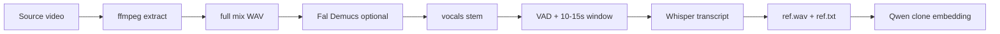

# Qwen3 voice pipeline — master formula (AI_Animation)

**Purpose:** One place to reproduce character dialogue (Frieren, Stark, future cast) without re-discovering fixes from S008/S012 iterations.

**Skill entry points:** [`qwen-frieren-dialogue`](../.cursor/skills/qwen-frieren-dialogue/SKILL.md) · shot logs under `docs/s###-*-qwen-dialogue-log.md`

---

## 1. Story grounding (always first)

| Step | Source | Output |
|------|--------|--------|
| Beat | `Chapter-81/stage_01_ingest.md` | B2/B3/B4… |
| Blocking + speakers | `Chapter-81/stage_02_shot_list.md` | Shot ID, who is on-screen |
| Dialogue order + voice note | `Chapter-81/stage_03_series_bible.md` § shot | JP/EN table, RTL notes |
| **Balloon truth** | `panels/eng/panel_s###jap.png` | Speaker tails, exact JP text |
| Still / mux anchor | `panels/eng/panel_s###.png` | Layout only — **do not** trust EN scan speaker labels |

**Rules learned (ch.81):**

- **RTL read** on JP pages: right column / upper balloon before left.
- **Do not split one manga sentence** across TTS phrases because of balloon line breaks (S012 Macht line).
- **Panel tails win** over EN scan layout (S012 left bubble → Frieren, not Fern).
- **No balloon** → do not invent “manga dialogue”; mark line as **scene reaction** or skip TTS.

---

## 2. Reference audio chain



| Stage | Tool | Output naming |
|-------|------|----------------|
| Extract | `ffmpeg -vn -ac 1 -ar 44100` | `voice_refs/<name>.wav` (full master) |
| Isolate | `scripts/isolate_vocals_fal.py` | `voice_refs/<name>_vocals.wav` |
| Curate | `scripts/prepare_frieren_qwen_ref.py` | `Voice Reference/<lang>/<Character>/` + `.txt` + `.json` |
| Cache | `voice_registry.local.json` | `qwen_speaker_embeddings.<Character>` |

**Windows:** local Demucs save often fails (torchcodec) → use **Fal** `isolate_vocals_fal.py` only.

**Frieren production ref:** `frieren_jp_qwen_ref.wav` + `.txt` (from `fireren Japan.mp4`, ~12s @ 24.6s).

**Stark production ref:** `stark_jp_qwen_ref.wav` + `stark_jp_qwen_ref.txt` (from `starksource.mp4` / `starksource.wav`).

---

## 3. Qwen3 Fal API (tier-1 defaults)

| Endpoint | Model id |
|----------|----------|
| Clone | `fal-ai/qwen-3-tts/clone-voice/1.7b` |
| TTS | `fal-ai/qwen-3-tts/text-to-speech/1.7b` |

### Clone (once per ref window)

```json
{
  "audio_url": "<uploaded ref wav, 10-15s, single speaker>",
  "reference_text": "<Whisper transcript of that exact window>"
}
```

**ICL trailing silence:** pad **0.5s** silence after ref (`append_trailing_silence`) so the last mora (e.g. った) does not bleed into phrase starts.

### TTS (per phrase)

```json
{
  "text": "<balloon Japanese>",
  "language": "Japanese",
  "speaker_voice_embedding_file_url": "<registry url>",
  "prompt": "<scene + character delivery hint>"
}
```

**Do not** pass `reference_text` on phrase TTS (causes 「た」prefix / ICL spill). **Do** pass `reference_text` on **clone** only.

---

## 4. Synthesis formula

### When to split phrases

| Situation | Mode |
|-----------|------|
| Two balloons / beats with natural pause (S008 よし。/やるか。) | **Split** + `concat_with_pauses` |
| One long sentence split across stacked balloons (S012 right column) | **One phrase** — no mid-sentence pause |
| Single short reaction (Stark awe) | **One phrase** (`--single-clip` or one call) |

### Pause between phrases

- Default **`0.55s`** (`FRIEREN_*_PAUSE_SEC`).
- Join via **`concat_with_pauses`**: resample 24k mono → **35ms fades** → **`apad`** (not `anullsrc` — avoids clicks).

### Prompt fields

| Layer | Content |
|-------|---------|
| Scene | Shot framing, who speaks, emotional beat |
| Character | Register, flat/deadpan vs warrior awe |
| JP timbre fix | `FRIEREN_JP_TONE` / `STARK_JP_TONE` when Qwen drifts bright |

**Avoid on Frieren:** ancient, grandmother, excited, bubbly, loud, 朗読.

**Stark personality:** [`docs/stark-qwen-personality-guide.md`](./stark-qwen-personality-guide.md) · skill `qwen-stark-dialogue`.

**Avoid on Stark:** villain growl, うわ/スゲー hype, shouty shounen, whisper-only, female register.

### Language

- **Default JP** for ch.81 manga balloons (`language: Japanese`).
- EN dub: `--language English` + `*_PHRASES_EN` constants.

---

## 5. Run commands (PowerShell)

```powershell
cd scripts

# 1) Ref prep (new character or new source clip)
python isolate_vocals_fal.py "..\voice_refs\starksource.mp4" --out "..\voice_refs\starksource_vocals.wav"
python prepare_frieren_qwen_ref.py --source "..\voice_refs\starksource_vocals.wav" --skip-demucs `
  --out-wav "..\Voice Reference\Japanese\Stark\stark_jp_qwen_ref.wav" --out-txt "..\Voice Reference\Japanese\Stark\stark_jp_qwen_ref.txt" `
  --out-meta "..\Voice Reference\Japanese\Stark\stark_jp_qwen_ref.json"

# 2) Dialogue (Frieren example)
python generate_s012_dialogue.py --reclone --language Japanese --tag frieren_dialogue_v6_ja

# 3) Stark S012 example
python generate_s012_stark_dialogue.py --reclone --language Japanese --tag stark_dialogue_v1_ja
```

**Reuse embedding:** `--skip-clone` when ref path + transcript unchanged.

**Force new timbre:** `--reclone`.

---

## 6. Deliverables & QC

| Artifact | Path |
|----------|------|
| Draft WAV | `outputs/voice/S###/s###_<speaker>_<tag>_<ts>.wav` |
| Meta | `outputs/voice/S###/s###_<tag>_meta_<ts>.json` |
| Approved | `outputs/voice/final/S###/` (copy best after QC) |

**QC checklist:**

- [ ] Text matches `panel_s###jap.png` (or documented scene reaction)
- [ ] RTL / phrase grouping correct
- [ ] No 「た」/ click at boundaries
- [ ] Timbre vs ref acceptable
- [ ] Duration fits Kling (`duration` 5 vs 10; warn if audio + `start_sec` > video)
- [ ] Meta JSON lists `voice_ref`, `phrases`, `prompt`, embedding ref

**Mux (optional):** `--mux` + `--start-sec` + `dialogue_mux.py` (duck default `0.35`).

**Lip-sync (production):** **PixVerse** — [`docs/pixverse-lipsync-log.md`](pixverse-lipsync-log.md) · skill [`.cursor/skills/pixverse-lipsync/SKILL.md`](../.cursor/skills/pixverse-lipsync/SKILL.md). `lipsync_fal.py` → `outputs/video/LipsyncTests/`. Silent I2V + final WAV + shot `start_sec`.

---

## 7. Known failures → fixes

| Symptom | Cause | Fix |
|---------|--------|-----|
| 「た」 before each phrase | `reference_text` on every TTS call | Clone only; 0.5s ref tail pad; `--reclone` |
| Click at pause | `anullsrc` concat (v10) | `concat_with_pauses` apad+fades (v11+) |
| Rushed two-beat | Single TTS clip | Split phrases |
| Line too short | `silenceremove` on phrases | Do not trim phrase edges |
| Frieren too bright (JP) | Qwen pitch drift | `FRIEREN_JP_TONE` in prompt |
| Wrong speaker | EN scan layout | JP panel tails + stage_02 |
| Truncated on Kling | 5s video, 15s audio | I2V `--duration 10` or shorter line |

---

## 8. Character registry

| Character | Ref wav | Transcript | Generator |
|-----------|---------|------------|-----------|
| Frieren | `Voice Reference/Japanese/Frieren/frieren_jp_qwen_ref.wav` | `.txt` | `generate_s004/006/008/012_dialogue.py` |
| Fern (JP) | `Voice Reference/Japanese/Fern/fern_jp_qwen_ref.wav` | `.txt` | `video source/fernsource.mp4` · S004+ |
| Frieren (EN) | `Voice Reference/English/Frieren/frieren_1min_qwen_ref.wav` | `.txt` | legacy S008 iterations |
| Stark | `Voice Reference/Japanese/Stark/stark_jp_qwen_ref.wav` | `stark_jp_qwen_ref.txt` | **`generate_s011_stark_dialogue.py`** (canon) · `generate_s012_stark_dialogue.py` (optional) |
| Fern | MiniMax clone | — | `generate_s005_dialogue.py`, S008 `--all-speakers` |

---

## 9. Shot-specific logs

| Shot | Log |
|------|-----|
| S004 Frieren | `docs/s004-frieren-qwen-dialogue-log.md` |
| S004 Fern | `docs/s004-fern-qwen-dialogue-log.md` · `docs/fern-qwen-personality-guide.md` |
| S006 | `docs/s006-frieren-qwen-dialogue-log.md` |
| S008 | `docs/s008-frieren-qwen-dialogue-log.md` |
| S012 Frieren | `docs/s012-frieren-qwen-dialogue-log.md` |
| S011 Stark | `docs/s011-stark-qwen-dialogue-log.md` |
| S012 Stark (optional) | `docs/s012-stark-qwen-dialogue-log.md` |

---

## 10. Code map

| File | Role |
|------|------|
| `scripts/qwen_tts.py` | Constants, clone, TTS, `concat_with_pauses`, `resolve_character_embedding` |
| `scripts/prepare_frieren_qwen_ref.py` | VAD window + Demucs + Whisper (any character source) |
| `scripts/isolate_vocals_fal.py` | Fal Demucs stem |
| `scripts/generate_s###_*_dialogue.py` | Per-shot CLI |
| `scripts/dialogue_mux.py` | ffmpeg overlay |

*Last updated: 2026-06-03 — includes Stark `starksource` ref + S012 reaction line.*
