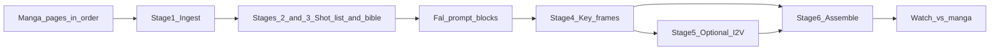

# Stages: manga chapter → anime-like sequence (Fal.ai)

This is the **recipe for making the anime**, not a scaling strategy. “Fail fast” only means: **the first time you run it, use a tiny slice of the chapter** (e.g. first scene / 2–3 pages) so you finish one full pass—**ingest → shots → Fal → assemble → watch**—before committing to the whole chapter.

## What you produce (the actual deliverable)

1. **Shot list** — Each story beat from the manga mapped to one or more shots (wide / medium / close-up as the panels suggest).
2. **Generated visuals** — Anime-style **key frames** per shot (Fal image models, with a stable style + character description).
3. **Optional motion** — Short **clips** from the best stills (Fal image-to-video or similar), where motion helps the beat.
4. **Assembly** — Shots ordered like the chapter; simple cuts and rough timing so you can **watch it as one piece** (even rough is fine in testing).

That is the “anime” in these stages: **a timed sequence of anime-looking shots that follow the chapter**, built from your page order and panel logic—not necessarily a broadcast-ready episode on v1.

## What you do (minimal)

1. Send **all pages of one chapter, in order** (names or upload order = reading order).
2. Optionally add constraints: aspect ratio, target rough length per scene, tone (PG vs mature for prompts).
3. After each assembled pass, say what breaks immersion (identity, style, pacing, motion)—so prompts and references get adjusted.

The assistant does: reading the pages, shot breakdown, series bible, Fal-oriented prompts, suggested model *types* (image vs I2V), assembly order, and a small **run log** (what settings produced what).

---

## Core stages (repeat per chapter or per scene)

### Stage 1 — Ingest and read the chapter

- Confirm page order; note chapter boundaries.
- Mark **beats**: tension change, location change, new character, big action. These become natural shot boundaries.

### Stage 2 — Turn panels into a shot list

For each beat, define:

- **What we see** (characters, pose, environment, emotion).
- **Framing** implied by the manga (don’t over-invent camera moves early).
- **Continuity** that must hold (outfit, injuries, time of day, props).

Output: a table or numbered list: `Shot 1, Shot 2, …` with one paragraph each. This is your **storyboard substitute**.

### Stage 3 — Lock style and characters (“series bible”)

Short bullet bible used as a **fixed prefix** on every Fal prompt:

- **Look:** cel anime, lighting, palette, line softness, film grain on/off.
- **Per character:** silhouette anchors (hair, eyes, clothes, height vibe).
- **Negatives:** extra limbs, mangled hands, random text, watermark, etc.

Goal: every shot feels like the **same show look**, not random illustrations.

### Stage 4 — Generate key frames on Fal (image pass)

For each shot:

- **Global style block** (from bible) + **shot-specific prompt** (action, setting, mood).
- Use **reference / img2img** when Fal supports it: manga panel or prior approved frame as guidance, with strength tuned so it follows layout but renders as anime.

Pick **hero references** (best face/full body) to reuse on later shots if identity drifts.

### Stage 5 — Add motion (optional but part of “anime feel”)

When stills are good enough:

- Choose shots that benefit from motion (wind, hair, impact, walking).
- One **short** clip per test; simple motion words; use the **strongest still** as the driver frame.
- Expect to iterate more on video than on stills—so fewer clips at first.

**Human-readable handbook:** [`docs/stage5-image-to-video-fal.md`](docs/stage5-image-to-video-fal.md) — default model, API fields, research links, motion-prompt recipe, S010 example.

**Agent skill (scene → motion prompt):** [`.cursor/skills/anime-scene-i2v-prompting/SKILL.md`](.cursor/skills/anime-scene-i2v-prompting/SKILL.md) — read stage_01–04 per shot, emit motion `prompt` from shot list + bible + optional QC logs.

**Agent skill (Fal API + research + checklist):** [`.cursor/skills/fal-image-to-video-prompting/SKILL.md`](.cursor/skills/fal-image-to-video-prompting/SKILL.md) — model **`fal-ai/kling-video/v2.6/pro/image-to-video`**, parameters, `generate_audio` cost, verification block.

### Stage 6 — Assemble and watch

- Order: same as shot list / chapter flow.
- **Timing:** hold keys longer or shorter to match dialogue rhythm if you’re mimicking bubbles; otherwise even holds are OK for testing.
- **Transitions:** hard cuts first; fades only if they help.

**Done criterion for a test run:** you can press play and **follow the chapter** without confusion.

### Stage 7 — Adjust and continue the chapter

- Fix **one** thing per circuit (prompt vs reference vs model choice).
- Reuse the locked bible and style block for the **next** beats; only extend the shot list.

---

## First run (testing): small slice, full pass through the stages

To learn fast, the **first execution** uses **only the opening 2–3 pages** (or first clear scene). You still complete **stages 1–6** so you’ve made a **mini anime block**, not just “some images.” After that, stage 7 applies to the rest of the chapter—the **same stages**, more shots.

---

## Diagram (stages overview)

---

## Out of scope for v1 (can add later)

- Full sound design, scoring, professional mix.
- Accurate lip-sync to dialogue (unless you add tooling).
- Automatic reading of all bubble text via OCR (optional; manual beat descriptions are enough for testing).
- **Pipeline dashboard (learner browser + pro Cursor Canvas)** — design log: [`docs/pipeline-dashboard-design-log.md`](docs/pipeline-dashboard-design-log.md).

---

## Concrete first session

Send **pages 1–3** in order. You should get back: **shot list + bible + Fal prompt pack per shot + assembly order + what to generate first on Fal** (image pass before I2V unless you explicitly want to test video immediately).
